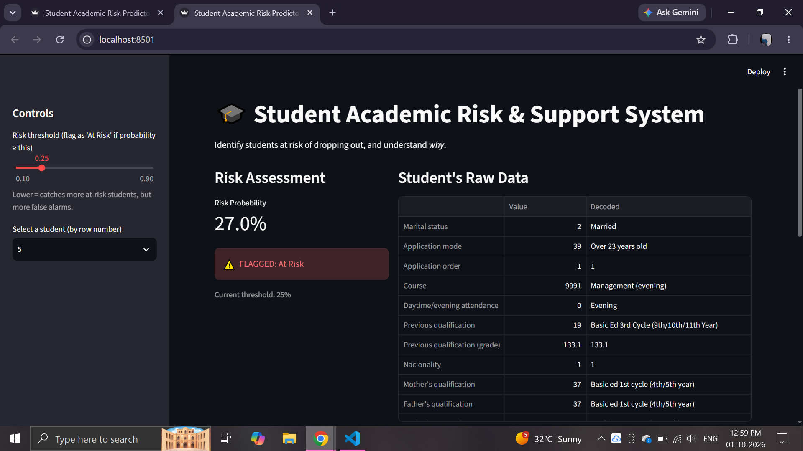

# 🎓 Student Academic Risk & Support System

An interactive machine learning dashboard that predicts whether a student falls into an at-risk category based on their academic and demographic data, and explains *why* - built to support early intervention rather than just flag a number.


**[🔗 Live Demo](https://student-risk-predictor-ycw7jidniikmrknwthhxje.streamlit.app/)**

## What this does

Academic advisors often only learn a student is struggling after it's too late to help. This project predicts dropout risk using data available from the first two semesters, and - just as importantly - explains which specific factors are driving each student's risk score, so the explanation itself is useful for the advisor, not just the number.

## Why it matters

A risk score with no explanation isn't actionable. This dashboard pairs a trained classifier with [SHAP](https://github.com/slundberg/shap) (SHapley Additive exPlanations) so every prediction comes with a transparent breakdown: which features pushed this student's risk up, which pulled it down, and by how much.

## Features

- **Live risk prediction** for any student in the dataset, via a Random Forest classifier
- **Adjustable risk threshold** - see how the flagging decision changes as you trade off catching more at-risk students vs. reducing false alarms
- **Per-student SHAP explanations** - the top factors driving each individual prediction
- **Human-readable data** - raw categorical codes are decoded into real labels (e.g. Course `9147` → "Management") using the official UCI codebook
- **Global feature importance** - a dataset-wide view of what drives risk in general

## Tech stack

- **Python** - pandas, scikit-learn, SHAP, matplotlib
- **Streamlit** - interactive web dashboard
- **Dataset**: [UCI Predict Students' Dropout and Academic Success](https://archive.ics.uci.edu/dataset/697/predict+students+dropout+and+academic+success) (4,424 students, 36 features, CC BY 4.0)

## How it works

1. **Data cleaning** (`src/load_data.py`) - load the UCI dataset, reframe the 3-class target (Dropout / Enrolled / Graduate) into a binary "At Risk" classification
2. **Exploratory analysis** (`src/eda.py`) - correlation analysis and grade distribution comparisons between at-risk and not-at-risk students
3. **Model training** (`src/train_model.py`) - train and compare Logistic Regression and Random Forest classifiers, using `class_weight="balanced"` to handle the ~68/32 class imbalance
4. **Threshold tuning** (`src/tune_threshold.py`) - since missing an at-risk student is costlier than a false alarm, the default 0.5 probability threshold was tuned to 0.35 to prioritize recall on the at-risk class
5. **Explainability** (`src/explain_model.py`) - SHAP TreeExplainer generates both global and per-student explanations
6. **Dashboard** (`src/app.py`) - Streamlit app tying it all together into an interactive tool

## Model performance

| Model | At-Risk Recall | At-Risk Precision |
|---|---|---|
| Logistic Regression | 83% | 79% |
| Random Forest | 80% | 82% |
| Random Forest (tuned threshold 0.35) | 89% | 72% |

Recall on the at-risk class was prioritized over raw accuracy, since the real-world cost of missing a struggling student outweighs the cost of an unnecessary check-in.

## Running it locally

```bash
# Clone the repo
git clone https://github.com/dsouzaaldon1311-boop/student-risk-predictor.git
cd student-risk-predictor

# Install dependencies
pip install pandas numpy matplotlib seaborn scikit-learn joblib streamlit shap

# Run the dashboard
cd src
streamlit run app.py
```

## What I learned

This was my first end-to-end ML project, built to strengthen my foundation ahead of pursuing an AI/ML master's. Key things I worked through:
- Handling class imbalance properly, rather than chasing a misleadingly high accuracy score
- The gap between a research paper's simplified documentation and the actual codes used in a published dataset - multiple fields required re-verifying the real category mappings directly against the source
- Why model explainability matters in applied settings - a correct prediction without a reason isn't very useful to the person who has to act on it
- Setting up a proper ML project structure with Git version control from early on, rather than retrofitting it later

## Dataset citation

Realinho, V., Vieira Martins, M., Machado, J., & Baptista, L. (2021). *Predict Students' Dropout and Academic Success* [Dataset]. UCI Machine Learning Repository. https://doi.org/10.24432/C5MC89

## Limitations and Hopefully Future Work

-The dataset is from a Portuguese institution and may not generalize to other educational contexts without domain adaptation.
-SHAP explanations are useful for individual predictions but aggregating them for department-level policy requires additional validation.
-The current system predicts risk at the end of the second semester; earlier prediction with less data is an open question.
